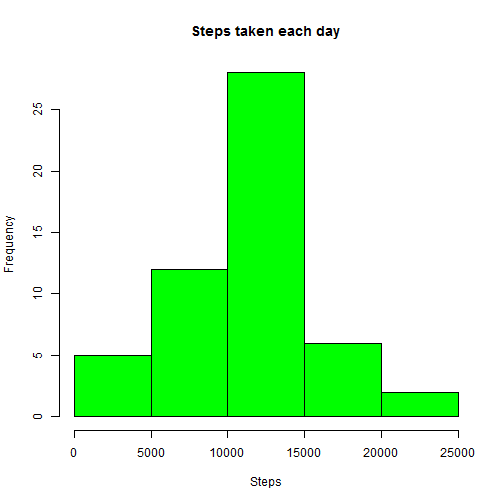
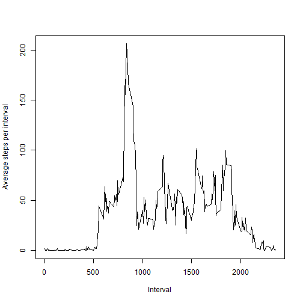
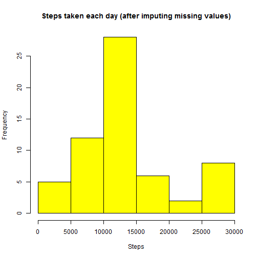
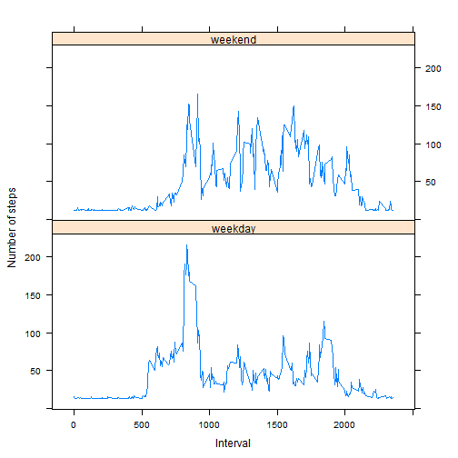

## Loading and preprocessing the data

First Load activity data from source file and remove any rows with NA values. 


```r
# read source data of activity
rawdata <- read.csv("activity.csv")

# remove rows of steps having NA values
tobeselected <- which(!is.na(rawdata$steps), )
finalstepsdata <- rawdata[tobeselected, ]
```
  
  
## What is mean total number of steps taken per day?

Histogram of the total number of steps taken each day is shown below. 


```r
# sum total steps taken each day
stepsperday <- aggregate(steps ~ date, finalstepsdata, sum)

# draw histogram
hist(stepsperday$steps, col="green", main="Steps taken each day", xlab="Steps")
```

 

```r
# calculate mean steps per day
meanstepsperday <- as.integer(mean(stepsperday$steps))
print(paste("Mean steps per day: ", meanstepsperday))
```

```
## [1] "Mean steps per day:  10766"
```

```r
# calculate median steps per day
medianstepsperday <- median(stepsperday$steps)
print(paste("Median steps per day: ", medianstepsperday))
```

```
## [1] "Median steps per day:  10765"
```


Mean total number of steps taken per day is 10766.  
Median total number of steps taken per day is 10765.  
  
  
## What is the average daily activity pattern?

Plot of average number of steps taken per 5-minute interval is shown below. 
Please note that data has been averaged across all days per interval. 


```r
# calculate average steps per interval
meanstepsperinterval <- aggregate(steps ~ interval, finalstepsdata, mean)

# draw line plot
plot(meanstepsperinterval$interval, meanstepsperinterval$steps, type="l", 
     xlab="Interval", ylab="Average steps per interval")
```

 

```r
# find out interval with max steps, over avearaged steps per interval
maxstepsval <- max(meanstepsperinterval$steps)

maxstepsrow <- meanstepsperinterval[which(meanstepsperinterval$steps 
                                          >= maxstepsval), ]

maxstepsinterval <- maxstepsrow$interval
# format interval to HH:MM:SS format
library(stringr)
maxstepsinterval <- str_pad(maxstepsinterval, 4, pad = "0")
maxstepsinterval <- paste(str_sub(maxstepsinterval, 1, 2), 
                          str_sub(maxstepsinterval, 3, 4), "00",   sep = ":")

print(paste("Interval with maximum number of steps: ", maxstepsinterval))
```

```
## [1] "Interval with maximum number of steps:  08:35:00"
```

  
5-minute interval with maximum number of steps is 08:35:00.  
  
  
## Imputing missing values

Note that there are a number of days/intervals where there are missing values
(coded as NA) in source data.  To avoid bias in calculations due to missing 
data, I have replaced NA value of steps to 100.  It is just assumption. 

Histogram of the new total number of steps taken each day is shown below. 

From calculations below, one can see that Mean and Median total number of steps
taken per day has changed (increased in this case). 


```r
# find out total missing values in source dataset
countNA <- which(is.na(rawdata$steps), )
print(paste("Total missing values in source dataset: ", length(countNA)))
```

```
## [1] "Total missing values in source dataset:  2304"
```

```r
# create new dataset similar to source dataset
newdataset <- rawdata

# imputing missing data, with random value of 100 steps
for (i in 1:length(countNA)) {
    
    index <- countNA[i]
    # set steps value to a fixed value 100 (randon number), instead of NA value
    newdataset[index, ]$steps <- 100  
}

# sum total steps taken each day
newstepsperday <- aggregate(steps ~ date, newdataset, sum)

# draw histogram
hist(newstepsperday$steps, col="yellow", 
     main="Steps taken each day (after imputing missing values)", xlab="Steps")
```

 

```r
# calculate mean steps per day - after imputing missing values
newmeanstepsperday <- as.integer(mean(newstepsperday$steps))
print(paste("New Mean steps per day: ", newmeanstepsperday))
```

```
## [1] "New Mean steps per day:  13131"
```

```r
# calculate median steps per day - after imputing missing values
newmedianstepsperday <- as.integer(median(newstepsperday$steps))
print(paste("New Median steps per day: ", newmedianstepsperday))
```

```
## [1] "New Median steps per day:  11458"
```
  
Total missing values in source dataset is 2304.  
New Mean total number of steps taken per day is 13131.  
New Median total number of steps taken per day is 11458.  
  
  
## Are there differences in activity patterns between weekdays and weekends?

I noticed that personal movement (activity) was more intense on weekends
as compared to weekdays, for given 5-minute intervals, in given 2 months. 

This conclusion is evident from panel plot shown below. 


```r
# add a factor variable for weekend and weekday, based on date
newdataset$date <- as.Date(newdataset$date)

newdataset$dayind <- factor(weekdays(newdataset$date) == "Saturday" | 
                                weekdays(newdataset$date) == "Sunday")
levels(newdataset$dayind)[levels(newdataset$dayind) == TRUE] <- "weekend"
levels(newdataset$dayind)[levels(newdataset$dayind) == FALSE] <- "weekday"

# dataset with rows for weekend
weekenddataset <- newdataset[which(newdataset$dayind == "weekend"), ]
# dataset with rows for weekdays
weekdaydataset <- newdataset[which(newdataset$dayind == "weekday"), ]

# mean weekend steps per interval
meanweekendsteps <- aggregate(steps ~ interval, weekenddataset, mean)

# mean weekday steps per interval
meanweekdaysteps <- aggregate(steps ~ interval, weekdaydataset, mean)

# draw plot with 2 panels - weekend and weekday
combine <- as.data.frame(cbind(meanweekendsteps$interval, 
                               meanweekendsteps$steps, meanweekdaysteps$steps))

names(combine) <- c("interval", "weekend", "weekday")

library(lattice)
p <- xyplot(weekday + weekend ~ interval, data = combine, layout = c(1,2), 
       type = 'l', outer = TRUE, xlab = "Interval", ylab = "Number of steps")

print(p)
```

 
